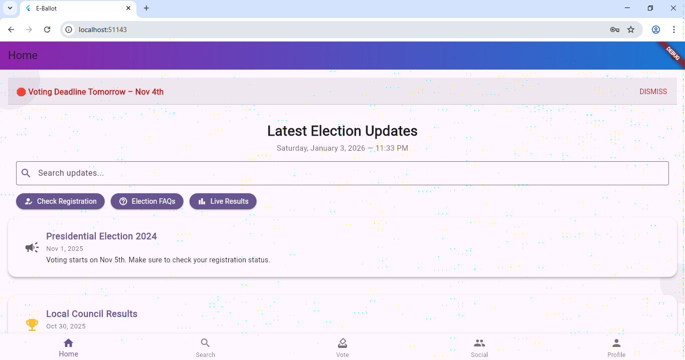
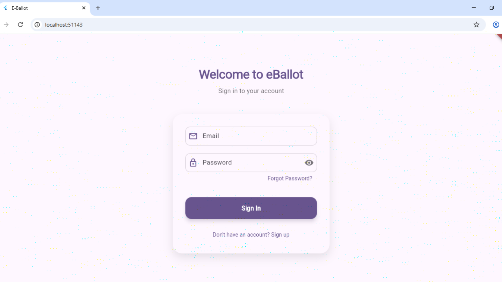

# eBallot

eBallot is a secure online voting platform designed to explore digital voting systems with authentication and verification features.

## Features
- User authentication
- Face verification integration
- Anonymous vote casting
- Secure database handling
- Mobile-friendly interface

## Tech Stack
- Flutter
- Firebase
- APIs

## Goal
The project focuses on building a secure, scalable, and accessible voting experience while exploring real-world application development and security concepts.

## Status
Currently under development.

## Screenshots

### Home Page

### Login Page

## Future Improvements
- Advanced face verification
- Admin dashboard
- Real-time vote analytics
- Enhanced security layers

## Developer
Ayushi Tripathi
